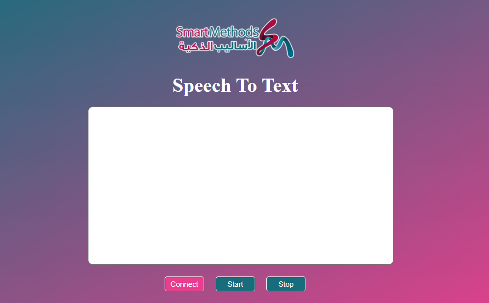

# Smart Methods Internship Task 2

### Main points: 
- The project idea is to Move a Robotic arm through specific commands received from a Speech-to-text website.
- Used Html, CSS, and javascript to build the website.
- used Web Speech API for voice recognition (Arabic).
- used Web Serial API allows a website to communicate with serial devices in this case Arduino UNO.

### Run:
-  Plug in Arduino UNO.
-  Connect Servo Motor to pin 8.

### Resources:
- Web Speech API: https://developer.mozilla.org/en-US/docs/Web/API/SpeechRecognition
- Web Serial API: https://web.dev/serial/

### Screenshot of the interface:

